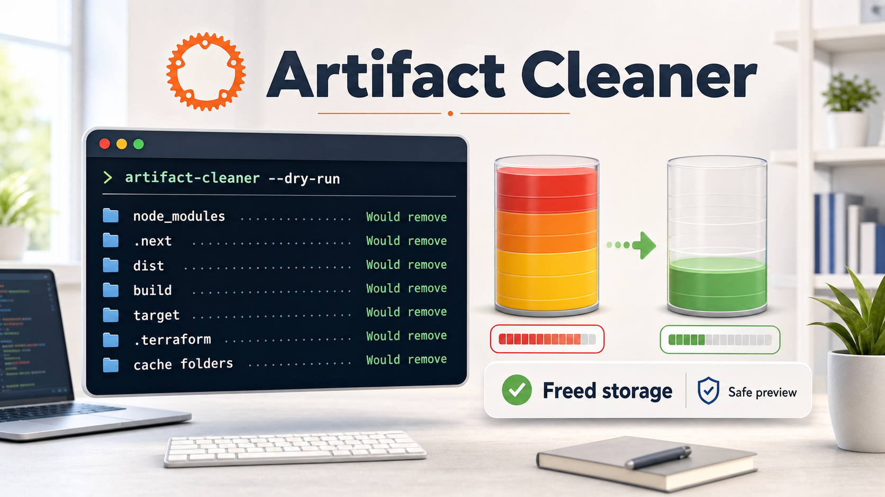

# Artifact Cleaner

[](https://github.com/chefgs/artifact-cleaner/actions/workflows/ci.yml)
[](https://github.com/chefgs/artifact-cleaner/actions/workflows/release.yml)
[](LICENSE)
[](https://www.rust-lang.org/)
[](CONTRIBUTING.md)

A Rust-based CLI tool for scanning and cleaning common development artifacts such as `node_modules`, `.next`, `dist`, `build`, `target`, `.terraform`, and cache folders.

This project is also used as a practical Rust learning project for Go, Python, and Java developers.

Built in Rust. Single binary. No dependencies.



## Recent updates

- Added `ac mac-lib` for scanning `~/Library/Caches`, `~/Library/Containers`, and `~/Library/Group Containers` for orphaned app and CLI data on macOS.
- Added release install scripts for macOS, Linux, and Windows with automatic platform detection and SHA256 verification.
- Kept CLI version output tied to Cargo package metadata so release binaries and source builds report the same version.

## Safe by default

The tool always shows what it found before deleting anything. By default, destructive cleanup requires an interactive confirmation prompt, and `--dry-run` previews what would be deleted without removing files.

For scripts and CI, deletion without a prompt requires the explicit `--yes` flag.

## Install

### One-liner (recommended)

The install scripts detect your OS and CPU architecture, download the matching release artifact, verify SHA256 checksums, install the binary into your `PATH`, and verify the binary runs.

**macOS and Linux**:
```bash
curl -fsSL https://raw.githubusercontent.com/chefgs/artifact-cleaner/main/install.sh | bash
```

Install a specific release:
```bash
VERSION=v0.6.0 curl -fsSL https://raw.githubusercontent.com/chefgs/artifact-cleaner/main/install.sh | bash
```

Install to a custom directory:
```bash
INSTALL_DIR="$HOME/.local/bin" curl -fsSL https://raw.githubusercontent.com/chefgs/artifact-cleaner/main/install.sh | bash
```

**Windows** (PowerShell):
```powershell
irm https://raw.githubusercontent.com/chefgs/artifact-cleaner/main/install.ps1 | iex
```

Install a specific release:
```powershell
$env:VERSION = "v0.6.0"
irm https://raw.githubusercontent.com/chefgs/artifact-cleaner/main/install.ps1 | iex
```

> Full install guide (manual steps, PATH setup, troubleshooting, SHA256 explanation):
> → **[INSTALL.md](./INSTALL.md)**

### Manual quick install

**macOS (Apple Silicon — M1/M2/M3):**
```bash
curl -Lo artifact-cleaner.tar.gz \
  https://github.com/chefgs/artifact-cleaner/releases/latest/download/artifact-cleaner-latest-aarch64-apple-darwin.tar.gz
tar -xzf artifact-cleaner.tar.gz
sudo mv artifact-cleaner-*/artifact-cleaner /usr/local/bin/
# First run: xattr -dr com.apple.quarantine /usr/local/bin/artifact-cleaner
```

**macOS (Intel):**
```bash
curl -Lo artifact-cleaner.tar.gz \
  https://github.com/chefgs/artifact-cleaner/releases/latest/download/artifact-cleaner-latest-x86_64-apple-darwin.tar.gz
tar -xzf artifact-cleaner.tar.gz
sudo mv artifact-cleaner-*/artifact-cleaner /usr/local/bin/
```

**Linux (x64 — static binary):**
```bash
curl -Lo artifact-cleaner.tar.gz \
  https://github.com/chefgs/artifact-cleaner/releases/latest/download/artifact-cleaner-latest-x86_64-unknown-linux-musl.tar.gz
tar -xzf artifact-cleaner.tar.gz
sudo mv artifact-cleaner-*/artifact-cleaner /usr/local/bin/
```

**Linux (ARM64 — static binary):**
```bash
curl -Lo artifact-cleaner.tar.gz \
  https://github.com/chefgs/artifact-cleaner/releases/latest/download/artifact-cleaner-latest-aarch64-unknown-linux-musl.tar.gz
tar -xzf artifact-cleaner.tar.gz
sudo mv artifact-cleaner-*/artifact-cleaner /usr/local/bin/
```

**Windows (x64 — PowerShell):**
```powershell
Invoke-WebRequest `
  -Uri "https://github.com/chefgs/artifact-cleaner/releases/latest/download/artifact-cleaner-latest-x86_64-pc-windows-msvc.zip" `
  -OutFile "artifact-cleaner.zip"
Expand-Archive -Path artifact-cleaner.zip -DestinationPath .
# Move artifact-cleaner.exe to a folder in your PATH — see INSTALL.md
```

**Windows (ARM64 — PowerShell):**
```powershell
Invoke-WebRequest `
  -Uri "https://github.com/chefgs/artifact-cleaner/releases/latest/download/artifact-cleaner-latest-aarch64-pc-windows-msvc.zip" `
  -OutFile "artifact-cleaner.zip"
Expand-Archive -Path artifact-cleaner.zip -DestinationPath .
# Move artifact-cleaner.exe to a folder in your PATH — see INSTALL.md
```

**Build from source (all platforms):**
```bash
cargo install --path .
```

Requires a current Rust toolchain with Cargo. The CLI version is sourced from `Cargo.toml`, so `artifact-cleaner --version` matches the package version for local builds too.

### Verify the install

```bash
artifact-cleaner --version
ac --version
artifact-cleaner --help
```

**Not sure which binary to pick?** See the [platform guide in INSTALL.md](./INSTALL.md#before-you-start--find-the-right-binary).

## Usage

Both `artifact-cleaner` (full name) and `ac` (short alias) are installed and identical.

### Scan workspace for stale build artifacts

```bash
# Scan current directory, 2-month threshold (default)
ac scan

# Scan a specific workspace
ac scan ~/Documents/github

# Use a 3-month threshold
ac scan ~/Documents/github --months 3

# Dry run — preview without deleting
ac scan ~/Documents/github --dry-run

# Skip confirmation prompt (for scripts/CI)
ac scan ~/Documents/github --yes

# Target specific artifact types only
ac scan ~/Documents/github --types node_modules,.next
```

### Scan macOS Library for orphaned data (macOS only)

```bash
# Scan Caches, Containers, and Group Containers (default: items > 100 MB)
ac mac-lib

# Preview without deleting
ac mac-lib --dry-run

# Set a custom size threshold (200 MB)
ac mac-lib --min-size 200

# Scan only Caches
ac mac-lib --dirs caches

# Scan Caches and Containers only
ac mac-lib --dirs caches,containers

# Skip confirmation prompt
ac mac-lib --yes
```

## Benchmark

Build an optimized binary first:

```bash
cargo build --release
```

Then benchmark a dry run with `hyperfine`:

```bash
hyperfine \
  './target/release/artifact-cleaner --path ~/projects --dry-run'
```

## Learn Rust with this project

This repo is designed to help Go, Python, and Java developers understand Rust through a real DevOps CLI project. The source code contains 34 inline `RUST LESSON` blocks explaining each language construct in context.

### Choose your learning path

**New to programming or Rust?**
→ Start with [RUST_LEARNING.md §0 — Before You Start](./RUST_LEARNING.md#0-before-you-start) then read the source files below.

**Already know Go, Python, or Java?**
→ Jump straight into the source files, then use [RUST_LEARNING.md](./RUST_LEARNING.md) as a reference.

**Prefer articles?**
→ Read the three-part series:
1. [Part 1: Foundations](articles/rust-learning-part-1-foundations.md)
2. [Part 2: Ownership, Borrowing, and Errors](articles/rust-learning-part-2-ownership-errors.md)
3. [Part 3: Production Patterns in a Real CLI](articles/rust-learning-part-3-production-patterns.md)

Or start even simpler: [Rust for Backend Developers](articles/rust-for-backend-developers.md).

### Suggested source reading order

```
src/scanner.rs              ← structs, constants, functions, iterators, match
src/cleaner.rs              ← ownership, error handling, implicit return
src/display.rs              ← imports, formatting, slices, private helpers
src/main.rs                 ← mod declarations, clap, subcommands, closures
src/mac_library/
  resolver.rs               ← enums as data, private helpers
  checker.rs                ← subprocess calls, std::process::Command
  scanner.rs                ← super::, flatten, closures, Option chaining
  mod.rs                    ← cfg, matches!, borrowing in loops
  display.rs                ← slices, tuple returns
```

**Quick reference:** [LESSONS.md](./LESSONS.md) — index of all 34 lesson blocks by topic with direct links to source lines.

## Commands

```
ac <COMMAND>

Commands:
  scan     Scan a workspace directory for stale build artifacts
  mac-lib  Scan macOS Library folders for orphaned app/tool data
  help     Print help for any command

ac scan [OPTIONS] [PATH]
  [PATH]                   Workspace directory to scan [default: .]
  -m, --months <MONTHS>    Stale threshold in months [default: 2]
  -t, --types <TYPES>      Artifact types [default: node_modules,.next,dist,build,.terraform]
  -d, --dry-run            Preview without deleting
  -y, --yes                Skip confirmation prompt
      --no-interactive     Non-interactive output only

ac mac-lib [OPTIONS]
      --min-size <MB>      Minimum item size to flag in MB [default: 100]
      --dirs <DIRS>        Directories to scan: caches,containers,groups [default: all]
  -d, --dry-run            Preview without deleting
  -y, --yes                Skip confirmation prompt
```

## What it skips (always safe)

- Python virtual environments: `.venv`, `venv`, `env`
- Python packages: `lib/python*`, `site-packages`
- Git metadata: `.git`
- Projects modified within the threshold window

## License

MIT
